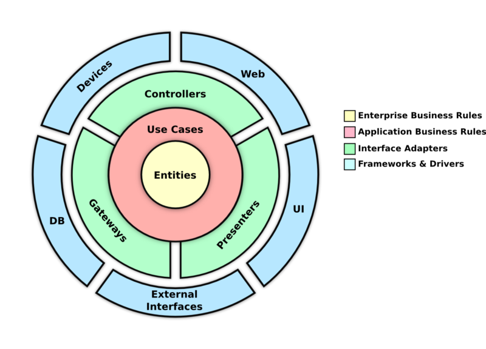

## Arquitetura
<div align="center">

## Arquitetura Do Projeto


## Arquitetura De Soluçao Atual


## Arquitetura De Soluçao Final


</div>


## Fundamentos teóricos

> A Clean Architecture esclareceu as responsabilidades de cada área da nossa aplicação, impondo limites arquiteturais através de regras imutáveis, exceto quando há alguma relação com o negócio. Geralmente essas regras são sólidas e geram uma estabilidade maior no coração da aplicação. Esse padrão foi chamado de Enterprise Business Rules ou Entidades, onde ficam as regras de negócio. 
Através desses detalhes você pode concluir que o conceito da Clean Architecture é uma forma de desenhar o software com limites arquiteturais bem claros, para torná-lo durável e também para facilitar a troca de componentes no coração da aplicação.
##  Pré -requisitos

- [ `Java 17+` ](https://www.oracle.com/java/technologies/downloads/#java11)
- [ `Docker` ](https://www.docker.com/)
- [ `Docker-Compose` ](https://docs.docker.com/compose/install/)


## Stack
- **Feing** chamadas de API
- **resilience4j** Resiliência de aplicações
- **Prometheus** Monitoramento de métricas
- **log4j** Log de aplicações
- **LocalStack** Mock de serviços AWS

## Links

- Prometheus
  - http://localhost:8080/actuator/prometheus
- Api Clientes
  - http://localhost:9090/clientes
- Api Conta
  - http://localhost:9090/contas
- Api Bacen
  - http://localhost:9090/notificacoes
- LocalStack
  - http://localhost:4566

## Melhorias a serem implementadas 
- Resiliencia
  - Colocar fallback nos retrys
- Cache
  - Implementar Redis com local stack e colocar cache na API de Clientes
- Swagger
  - Documentar os endpoints com swagger
- Testes
  - Evoluir os testes de integraçao com BDD e cucumber
  
# Desenvolvimento e Deploy


## Passo 1: Preparação do Ambiente

Clone o repositório do projeto para sua máquina local usando o Git:

```bash
git clone https://github.com/lfernandoss/DesafioItau.git
cd DesafioItau
```

## Passo 2: Construção dos Containers com Docker Compose

Na raiz do projeto, onde o arquivo docker-compose.yml está localizado, execute o comando abaixo para construir e iniciar todos os containers do Wiremock e localStack definido no Docker Compose:

```bash
docker-compose up --build -d
```

## Passo 3: Baixar as Dependências do Projeto e Executar a Aplicação

Utilizando o Maven, baixe as dependências do projeto e execute a aplicação:


```bash
mvn clean install 
```


## GET Mock Client

  http://localhost:9090/clientes/bcdd1048-a501-4608-bc82-66d7b4db3600
  
  http://localhost:9090/clientes/2ceb26e9-7b5c-417e-bf75-ffaa66e3a76f

  + Response 200 (application/json)

    + Body

            {
                "id": "bcdd1048-a501-4608-bc82-66d7b4db3600",
                "nome": "João Silva",
                "telefone": "912348765",
                "tipoPessoa": "Fisica"
            }
  


## GET Mock Contas

  http://localhost:9090/contas/d0d32142-74b7-4aca-9c68-838aeacef96b
  
  http://localhost:9090/contas/41313d7b-bd75-4c75-9dea-1f4be434007f

  + Response 200 (application/json)

    + Body

            {
                "id": "d0d32142-74b7-4aca-9c68-838aeacef96b,
                "saldo": 5000.00
                "ativo": true
                "limiteDiario": 500.00
            }


      

## PUT Mock Contas - Atualiza Saldo

  http://localhost:9090/contas/saldos

  + Request (application/json)

    + Body

            {
              "valor": 1000.00,
              "conta": {
                  "idOrigem": "d0d32142-74b7-4aca-9c68-838aeacef96b",
                  "idDestino": "41313d7b-bd75-4c75-9dea-1f4be434007f"
              }
            }

  + Response 204 - No content (application/json)


## POST Mock Bacen

  http://localhost:9090/notificacoes

  + Request (application/json)

    + Body

            {
              "valor": 1000.00,
              "conta": {
                  "idOrigem": "d0d32142-74b7-4aca-9c68-838aeacef96b",
                  "idDestino": "41313d7b-bd75-4c75-9dea-1f4be434007f"
              }
            }

  + Response 204 - No Content (application/json)
      


## POST API Transferência

http://localhost:8080/transferencia

  + Request (application/json)

    + Body

            {
              "idCliente": "2ceb26e9-7b5c-417e-bf75-ffaa66e3a76f",
              "valor": 1000.00,
              "conta": {
                  "idOrigem": "d0d32142-74b7-4aca-9c68-838aeacef96b",
                  "idDestino": "41313d7b-bd75-4c75-9dea-1f4be434007f"
              }
            }

  + Response 200 (application/json)

    + Body

            {
                "id_transferencia": "410bb5b0-429f-46b1-8621-b7da101b1e28"
            }
